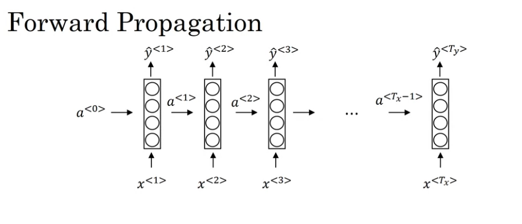
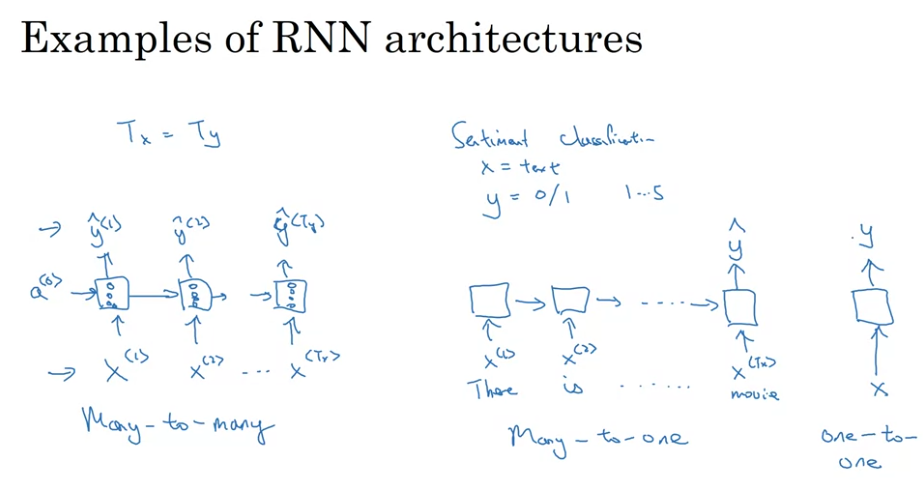
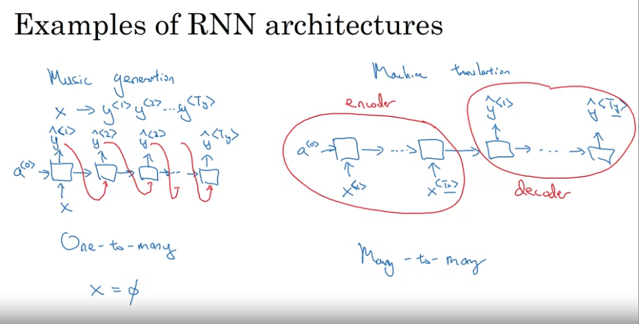
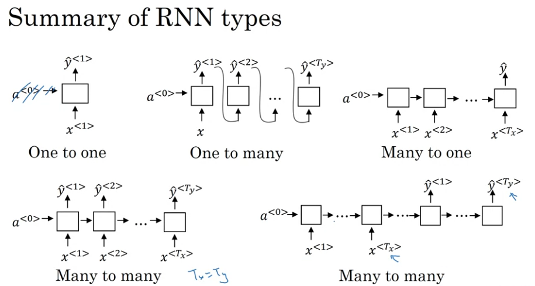
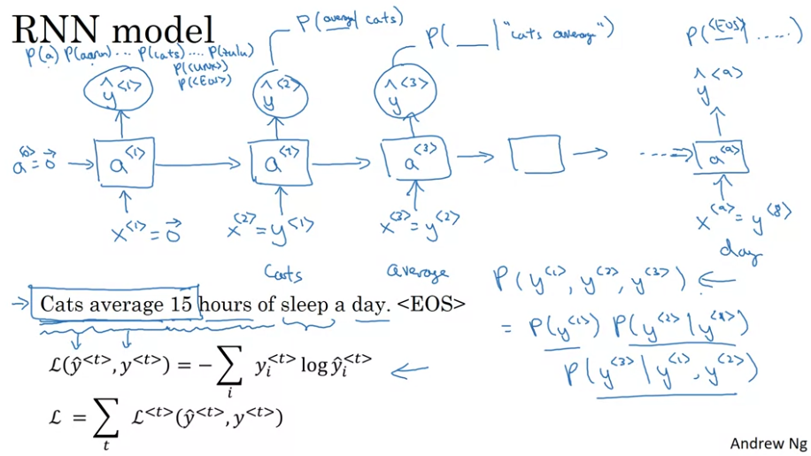
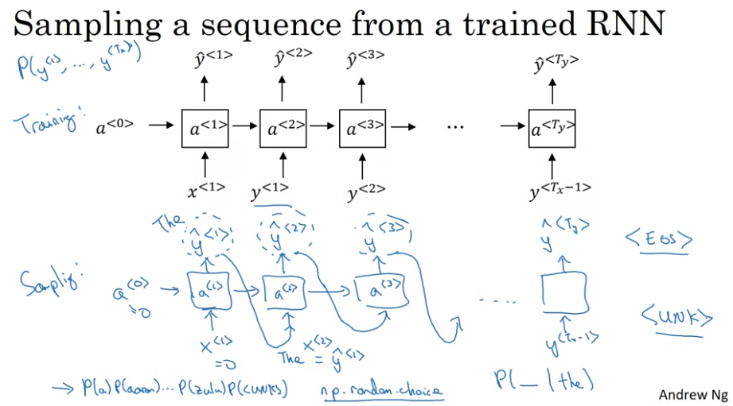
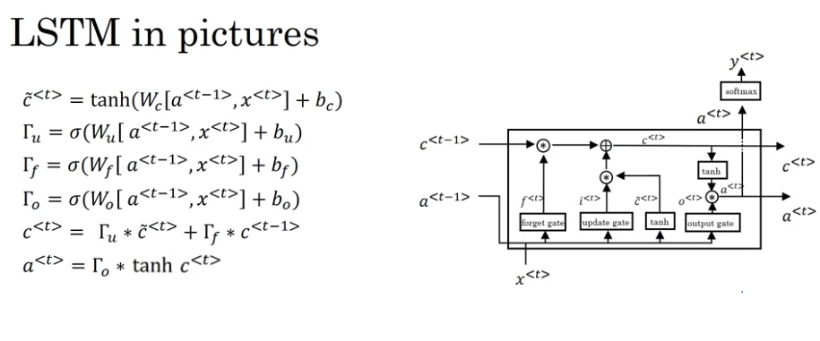
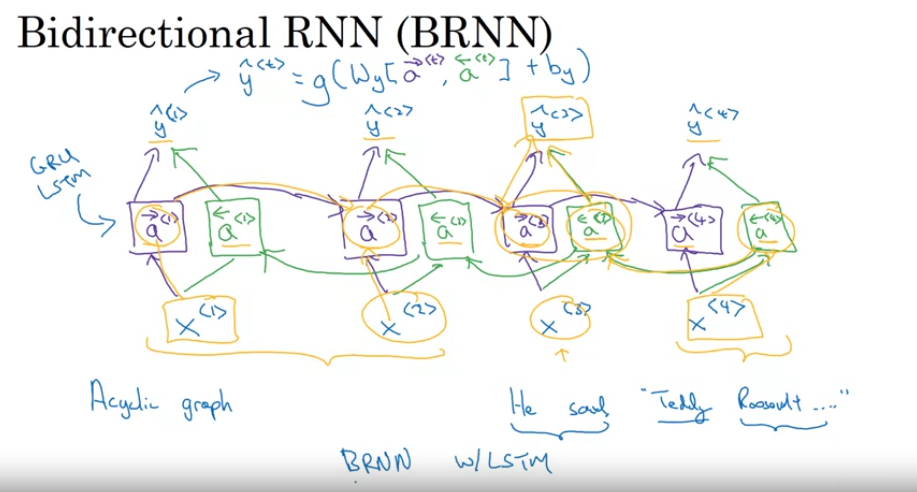
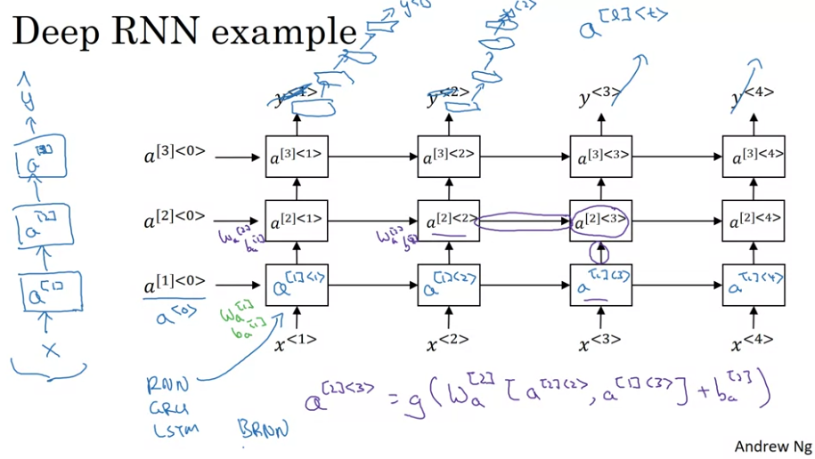

# Recurrent Neural Networks

## Why Sequence Models

### Some Examples of Sequence Models
- Speech Recognition: Input (audio signal), Output (Sequence of Text)
- Music Generation: Input (nothing or an integer representing the genre), Output
(music)
- Sentiment Classification: Input (Sequence of Text), Output (Integer
rating)
- Machine Translation: Input (Language A), Output (Language B)
- Video Activity Recognition: Input (Sequence of Images), Output (Action)

There are lots of different types of sequence data. Some with sequence data
as input and output, while others only have sequence data as the input or
just the output.
## Notation A Motvating Example
We would like to output a one for every word that is part of a person's name
and a zero for every word that is not.

<pre> x: "Harry Potter and Hermione Grainger invented a new spell."

y: 1 1 0 1 1 0 0 0 0 </pre>

$x^{<t>}$ represents the t-th element in the input sequence. $y^{<t>}$
represents the t-th element in the output sequence.

$x^{(i)<t>}$ represents the t-th element in the i-th input sequence.
$y^{(i)<t>}$ represents the t-th element in the i-th input sequence.

$T_x^{(i)}$ represents the length of the i-th input sequence. $T_y^(i)$
represents the length of the i-th output sequence. They do not necessarily
have to be the same length. They just happen to be the same length in this
example.

To start representing the words, we need a vocabulary. In this example, say
we have a vocabulary of 10,000 words.

Left column shows the vocabulary. Right column shows their associated label
as an integer.

$\begin{bmatrix} a \\ aaron \\ \vdots \\ and \\ \vdots \\ harry \\ \vdots \\
potter \\ \vdots \\ zulu \end{bmatrix}$ $\begin{bmatrix} 1 \\ 2 \\ \vdots \\
367 \\ \vdots \\ 4075 \\ \vdots \\ 6830 \\ \vdots \\ 10,000 \end{bmatrix}$
**How to choose your vocabulary?**
You can look through your training set and choose the 10,000 most frequent
words.

Each word in the input sequence would be represented as a one-hot encoded
vector.
**What if you run into a word you don't have in your vocabulary?** Just
*express it
as \<UNK\>
## Recurrent Neural Network Model
Why not use fully connected network?

- Inputs are of varying sizes, even if you padded with zeros, it is not a
very good representation of the data - Learned features aren't shared across
different positions of the sequence

Above is the base RNN model.

Each layer takes in an activation, a character $x^{<t>}$, and predicts the
output character $y^{<t>}$ and the activation for the next layer.
**Important things to note:**
The first activation $a^{<0>}$ is usually all zeros.

The length of inputs and outputs happen to be the same in this case. If they
were not the same length, then the architecture would have to change.

This architecture does not take advantage of information in the future.

In the sentence "Teddy Roosevelt was our president", in order to know that
the word "Teddy" is part of a name, you'd have to see the word after "Teddy"
to realize this. But the current RNN structure has no way of extracting this
information.
### The functions inside the RNN
$a^{t} = g_1(W_{aa} * a^{<t-1>} + W_{ax} * x^{<t>} + b_a)$

$\hat{y}^{<t>} = g_2(W_{ya} * a^{<t>} + b_y)$

Usually the activations used are tanh / relu.

Let's re-write the first equation above.

$a^{<t>} = g_1(W_a[a^{<t-1>}, x^{<t>}] + b_a)$

where:

$W_a = [W_{aa} | W_{ax}]$ and $[a^{<t-1>}, x^{<t>}] = \begin{bmatrix}
a^{<t-1>} \\ -- \\ x^{<t>} \end{bmatrix}$

$W_{aa} * a^{<t-1>} + W_{ax} * x^{<t>} = [W_{aa} | W_{ax}] * \begin{bmatrix}
a^{<t-1>} \\ -- \\ x^{<t>} \end{bmatrix}$

The advantage of using this notation is that it allows for more compact
matrix multiplications. Matrix multiplication is more efficient then regular
summations.
## Backpropagation Through Time
SKIP
## Different Types of RNNs

**Many-To-Many (input/output lengths are equal):**
Ex: Classifying each word in a sentence as belonging to a person's name or
not.

Tx = Ty
**Many-To-One:**
Ex: Sentiment classification. Given a sentence about the movie, how would you
describe the movie rating on a scale of 1-5.

**One-To-Many**
Music Generation. Your input could just be the vector of zeros. And it would
output a song of some length.

Input to each RNN unit is output of previous RNN units,except for the first
RNN unit, whose input is vector of zeros.
**Many-To-Many (input/output lenghts are NOT equal)**
Tx != Ty

Think of machine translation. Translating English to French.

This architecture takes in an encoder-decoder architecture. The encoder takes
in all the inputs of the input language. The final RNN unit in the encoder
outputs to the decoder, which is the part that outputs the translated
language.

**One-To_One:**
This is really just a standard neural network. No need even for an input
activation.
### Summary of Different RNN Architectures

## Language Model and Sequence Generation
What is language modeling?

Speech Recognition:

If I say, "The Apple and Pear Salad",

Did I say, "The Apple and Pear Salad" or "The Apple and Pair Salad?"

A good language model would correctly predict "The Apple and Pear Salad."
### How to train a language model
Training Set: Large Corpus of english text

We need to tokenize our sentence.

"Cats average 15 hours of sleep a day. \<EOS\>"

\<EOS\> is the end-of-sentence token

If you run into a word that is not in your corpus, then you can replace it
with the unknown token \<UNK\>.

First input is the zeros vector. Each subsequent input is the correct
previous output. You can train this with the standard cross-entropy loss.

Question: How is the first RNN unit ever supposed to guess the first correct
word if it's always given the vector of zeros? Won't it always just output
whatever is the most likely word?

## Sampling Novel Sequences
If you have a trained RNN, you can sample from it to get novel sequence
generation. For example, if your RNN was trained on shakespeare text, then
you can use it to randomly generate shakespeare-like text.

You pass in vector of all zeroes for first unit again. Then you sample the
softmax probabilities (`np.random.choice`) for a word and use that as the
input to your next RNN unit. And so on and so forth until you hit an /<EOS/>
token, or you can stop at some pre-determined number of words.

### Character-Level Models
It is possible to represent NLP models using a character-level vocabulary
instead of a word-level vocabulary. But the struggle at capturing long-range
dependencies, and they are more comptationally expensive to train.
## Vanishing Gradients with RNNs
Say you have a sentence like this:

"The cat, which already ate, .........................., was full."

"The cats, which already ate, .........................., were full."

You needed to remember whether or not the "cat" was singular or "cats"
plural.

This is hard to do with the standard RNNs units we've seen so far, due to the
vanishing gradient problem. This is addressed with GRU's and LSTM's which are
covered in the next few videos.
## Gated Recurrent Network (GRU)

### GRU (Simplified Model)
c = memory cell

For now, $c^{<t>} = a^{<t>}$. But the memory cell doesn't always equal the
activation.

This memory cell is how we are going to remember whether or not "cat" is
singular or "cats" plural as shown in the last example.

$\tilde{c}^{<t>} = tanh(W_c[c^{<t-1>}, x^{<t>}] + b_c)$

$\tilde{c}$ is a candidate for replacing $c$.

$\Gamma_u = \sigma(W_u[c^{<t-1>}, x^{<t>}] + b_u)$

This $\Gamma_u$ is the update gate which determines whether or not to update
the memory cell. It's used as a weighted average.

$c^{<t>} = \Gamma_u * \tilde{c}^{<t>} + (1 - \Gamma_u) * c^{<t-1>}$

The update gate is usually very close to zero or very close to one due to the
nature of the sigmoid function.

This helps greatly with the vanishing gradient problem because this means the
equation for updating $c^{<t>}$ is always just assignment to a constant. The
gradient is always one (I think...).

Don't forget that the memory cell and update gate are vectors! Asterisks
denote element-wise multiplication. If there's no asterisk, then it is matrix
multiplication.
### GRU (Full Model)
There is a relevance gate that was left out initially. Below are the full
updated equations.

$\tilde{c}^{<t>} = tanh(W_c[\Gamma_r * c^{<t-1>}, x^{<t>}] + b_c)$

$\Gamma_u = \sigma(W_u[c^{<t-1>}, x^{<t>}] + b_u)$

$\Gamma_r = \sigma(W_r[c^{<t-1>}, x^{<t>}] + b_r)$

$c^{<t>} = \Gamma_u * \tilde{c}^{<t>} + (1 - \Gamma_u) * c^{<t-1>}$

$a^{<t>} = c^{<t>}$
## Long Short-Term Memory (LSTM)

Instead of just having gate to update the memory cell, we have explicit
update and forget gates which allow the weights for the candidate memory cell
and previous memory cell to go outside the zero to one range.

GRU's were derived after the LSTM as a sort of simplified version of the
LSTM.

The advantage of the GRU is that it is simpler, so it is computationally less
expensive and is easier to use to build large networks. LSTM is more
powerful. If you had to default to one, choose the LSTM.

## Bi-Directional RNN

These RNN's allow you to take advantage of information in the past and the
future for computing the current time-step.

Think of an example where you are trying to identify whether or not a word
is part of a person's name or not. The phrase "Teddy Roosevelt." To know that
teddy is part of a person's name, you'd have to know that the next word is
Roosevelt.

## Deep RNNs
Normaly, we would stack these RNNs to get multi-layer RNNs aka Deep RNNs. However, do note that RNNs tend to be much harder to train. You wouldn't have hundreds or even dozens of RNN layers like you would for CNNs.

