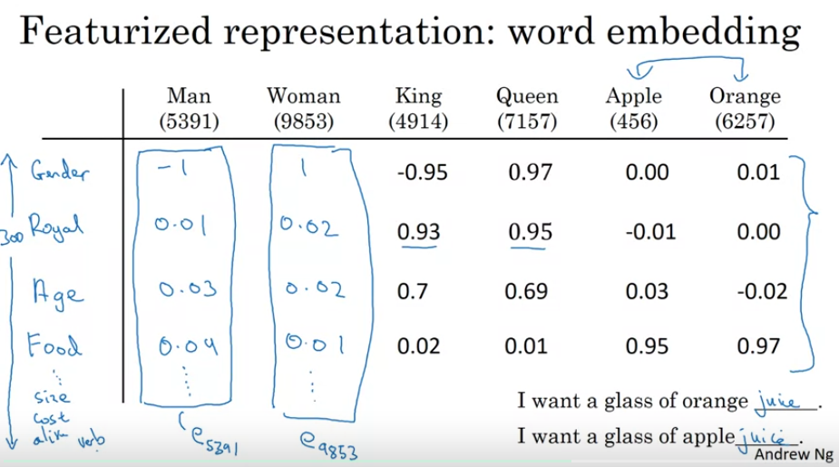
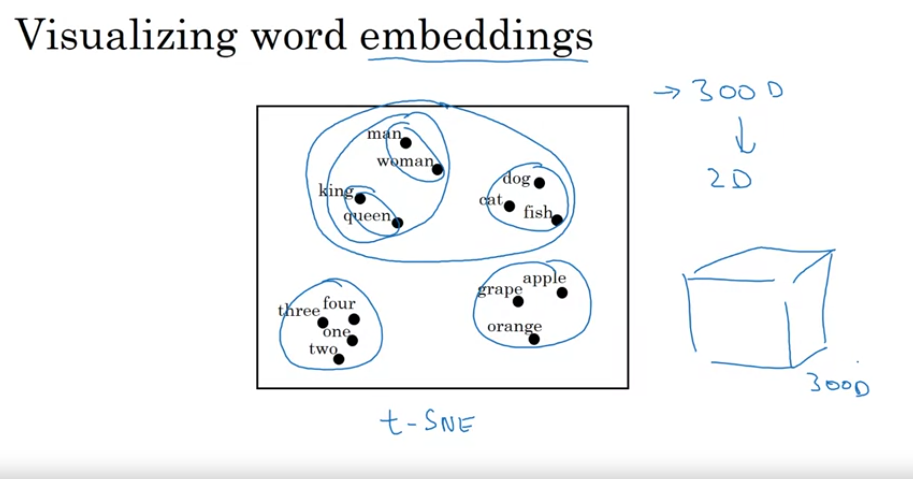
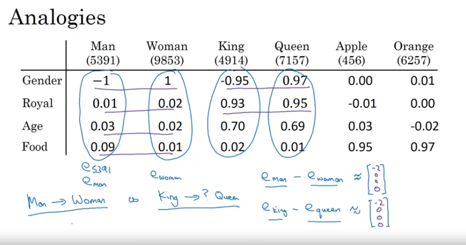

# Introduction to Word Embeddings

## Word Representation

Normally, we would represent each word as a one-hot vector. But this restricts
the model from generalizing.

"I want a glass of orange ________". The model may learn to fill in the blank
with the word "juice," which is the correct answer. But if I then give it the
sentence "I want a glass of apple ______". It has no way of generalizing
that the answer to the second sentence is also "juice" because if you
represent the words "orange" and "apple" as both one-hot vectors, the
dot-product between the two words, between all the words, is always zero.
There is no way to know that there is a similarity between the words "apple"
and "orange."

Instead, we can featurize the words.

Features like gender, age, food, size, etc., which are all quantified as numbers
between -1.0 and 1.0.



With this representation, it is clear that apple and orange are actually
very similar, allowing the model to learn the relationship between apple
and orange and generalizing them as fruit.

Exactly what each feature represents is hard to figure out just by looking
at the numbers.

Normally, these feature vectors will have hundreds of features.

### Visualizing Word Embeddings

We visualize these features by transforming the feature vectors into the 2D space
using an algorithm like t-SNE.

**Question:** If you are no longer representing the words as one-hot vectors,
then how can you use cross-entropy loss?



## Using Word Embeddings

Now that we have featurized our words, given the sentences,
```
"Sally Johnson is an orange famer"
"Robert Lin is an apple farmer"
```
Your model should be able to generalize in both causes, which words belong to
a person's name.

What if your model sees an example like this:

```
"Robert Lin is a durian cultivator"""
```

If you trained on a small training set, your model may never have seen the words
"durian" or "cultivator" before, but if your model has learned good word
embeddings such that it learns that "durian" is a fruit and that cultivator
is like a farmer, then it should still be able to predict which words of the
sentence belong to a person's name.

You could start off with a very large corpus online of 1-100 Billion words
and use those words to learn helpful word embeddings. And then use those word
embeddings for your specific task such as name recognition. Because you have
the word embeddings, you can decide to only use 100K words for your training
set instead of billions of words.

### Transfer Learning and Word Embeddings

1. Learn Word Embeddings from large text corpus. (1-100 Billion words)
   (Or download pre-trained embedding online)
2. Transfer embedding to new task with smaller training set. (say, 100K words)

Now instead of using a 100,000 length one-hot vector, you might be able to use
just a 3,000 length featureized vector. However, the one-hot vector is sparse
whereas the 3,000 length featurized vector is not.

3. Optional: Continue to finetune the word embeddings with new data.

## Properties of Word Embeddings

How would you solve the problem of analogy completion?

Example:

```
Man is to Woman as King is to ______
```

The correct answer is "Queen."

If you represent your words in a good featurized fashion, you can learn that
the difference between these man and woman is just the gender and find a word
where the difference between that word and King is also just the gender.



**Question:**
In our example, there was only one feature where there was a large
difference. What if two features had roughly the same large difference, the
maximum difference in the feature vectors? And you had two candidates, where
each candidate vector had exactly one of those features with the same large
difference? I suppose that is just an inherently ambiguous case.

To solve our analogy example above, we would need to solve
$e_{man} - e_{woman} \approx e_{king} - e_?$

Find the word w:

$\argmax_w = similarity(e_?, e_{king} - e_{man} + e_{woman})$

A common similarity function would be cosine similarity. Which is just essentially
dot product.

cosine similarity = $\frac{\mathbf{u} \cdot \mathbf{v}}{\| \mathbf{u} \| \| \mathbf{v} \|}$

You could also use euclidean norm of the difference between the two vectors,
but this would actually be a measure of dissimilarity.

## Embedding Matrix

To get our word embeddings, we learn an embedding matrix $E$.

Say we want our embedded vectors to be 300 dimensional vectors and our corpus
has 10,000 training examples, our embedding matrix would be of size 300 x 10,000.

Matrix multiplication
$E O_j = e_j$

Where $O_j$ stands for the j-th one-hot encodeded vector where element j is 1.
$e_j$ is the resulting embedded vector. Because the one-hot encoded vector is
so sparse, it is actually inefficient to do this as a matrix multiplication.
Instead, just look up the j-th column in the embedding matrix. It's the same
thing.